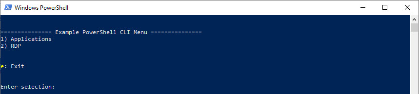
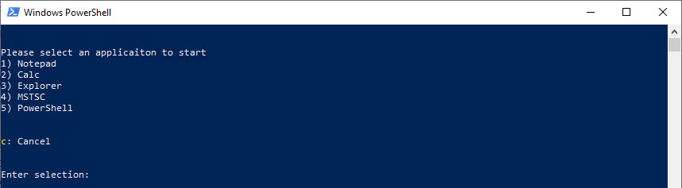
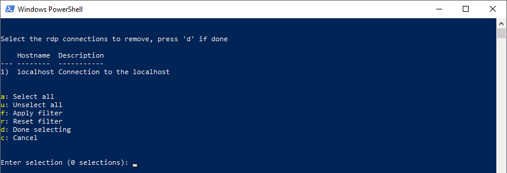

# powershell cli menu helpers

[[_TOC_]]

## Introduction

PowerShell CLI Menu Helpers is a module which offers few helpers functions to:

- Render a menu inside a PowerShell CLI with options (exit and back)



- Select items from a list witch options (cancel, filter, multiselect, etc.)



- Select items from a table witch options (cancel, filter, multiselect, etc.)



## Installation

### From PowerShell Gallery

```powershell
Install-Module -Name 'powershell-cli-menu-helpers'
```

### From Source

- Obtain the source

```
git clone https://github.com/netcloudag/powershell-cli-menu-helpers.git
```

- Navigate to the source directory

```
cd path\to\powershell-cli-menu-helpers
```

- Test

```
.\test.ps1
```

- Build

```
.\build.ps1
```

- Import the module

```
Import-Module -Name '.\build\powershell-cli-menu-helpers'
```

## Usage

### Menu rendering

Use the function `Select-MenuEntryFromList` to render a menu inside the cli. \
The function provides an `ExitOption` and a `BackOption` option. \
This will allow to perform the needed action based on the returned value. \
Take also a look at `Get-Help -Name Select-MenuEntryFromList -Full` for furhter details.

```powershell
# Render a menu with back and exit option
# Set the menu title and the menu entries
[System.String[]]$MenuEntries = @('Menu 1', 'Menu 2', 'Menu 3')
[System.String]$MenuTitle = "=============== Test Menu ==============="

# Ask user for the menu entry
[PSCustomObject]$SelectedMenuEntry = Select-MenuEntryFromList -MenuTitle $MenuTitle -MenuEntries $MenuEntries -ExitOption -BackOption

# Do the action based on the selection
switch ($SelectedMenuEntry.State)
{
    '%OK%'
    {
        Write-Host -Object "Selected menu entry: $($SelectedMenuEntry.MenuEntry)"
    }

    '%BACK%'
    {
        Write-Host -Object "Back option selected"
    }

    '%EXIT%'
    {
        Write-Host -Object "Exit option selected"
    }
}
```

### List rendering

Use the function `Select-ItemFromList` to render a list inside the cli. \
The function provides various options like `MultiselectOption` or `FilterOption`. \
Take also a look at `Get-Help -Name Select-ItemFromList -Full` for furhter details.

```powershell
# Select multiple processes to get furhter detailes later
$Processes = Select-ItemFromList -ListTitle "Select process, press 'd' if done" -Items (Get-Process | Select-Object -First 10) -PropertyName 'ProcessName' -MultiselectOption -CancelOption -FilterOption
if ($Processes.State -eq '%OK%')
{
    foreach ($Process in $Processes.Items)
    {
        $Process | Select-Object -Property Id, ProcessName
    }
}
```

### Table rendering

Use the function `Select-ItemFromTable` to render a table inside the cli. \
The function provides various options like `MultiselectOption` or `FilterOption`. \
Take also a look at `Get-Help -Name Select-ItemFromTable -Full` for furhter details.

```powershell
# Select multiple processes to get furhter detailes later
$Processes = Select-ItemFromTable -TableTitle "Select process, press 'd' if done" -Items (Get-Process | Select-Object -First 10) -PropertyName 'Id', 'Handles', 'ProcessName' -MultiselectOption -CancelOption -FilterOption
if ($Processes.State -eq '%OK%')
{
    foreach ($Process in $Processes.Items)
    {
        $Process
    }
}
```

## Example

An example powershell cli menu is provided under `.\example`. \
It shows how to combine the functions to display a powrshell cli menu and perfome actions. \

```powershell
cd .\example\
.\menu_script.ps1
```


## Contributing

Contributions are welcome, please refere to [CONTRIBUTING.md](https://github.com/netcloudag/powershell-cli-menu-helpers/blob/master/CONTRIBUTING.md) for details.

## Creating a release

### Requirements

```powershell
Install-Module -Name 'Pester'
Install-Module -Name 'PSScriptAnalyzer'
```

### Steps

- Add / modify the test cases inside the folder `.\tests`
- Run the tests (`.\test.ps1`)
- Update the [CHANGELOG.md](https://github.com/netcloudag/powershell-cli-menu-helpers/blob/master/CHANGELOG.md)
- Update the `ModuleVersion` inside the [config.json](https://github.com/netcloudag/powershell-cli-menu-helpers/blob/master/config.json)
- Add release tag on github
- Run the script `.\build.ps1` to create a new build
- Run the scirpt `.\publish.ps1` to publish the build to PowerShell Gallery

## Authors

- **Philipp Knoll** - _Initial idea / Initial work_
- **Patrick Grazioli** - _Implementation_

## License

This project is licensed under MIT with Copyright (c) 2020 Netcloud AG. \
See the [LICENSE.md](https://github.com/netcloudag/powershell-cli-menu-helpers/blob/master/LICENSE.md) file for details.
